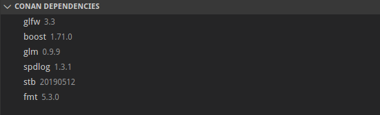

# vs-conan README

Conan support for visual studio code. 

## Features

Conan dependencies tree view: 

## Requirements

There is no requirements.

## Extension Settings

There is no settings yet.

## Known Issues

 - conanfile.py isn't supported yet

## Release Notes

### 0.1.0
#### Added
 - Conan Requirements tree view
 

Thank you for using Vscode-Conan extension!
